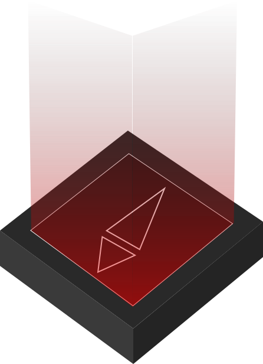

<h1 align="left">Olá! Meu nome é Emily Felicio.</h1>

  
💻 Eu realmente amo programar

  
💾 Focando em JavaScript

  
💭 Acho que é isso, por enquanto...

  
🌒 Então, Seja muito bem-vindo(a/e) ao meu GitHub!!!

   
 
  
  
  
  
  
  

 

 

  
  
  
  
  
  

 
 

  
  
  

